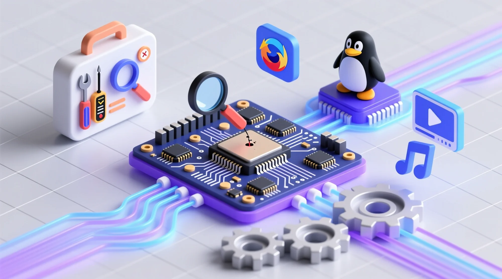

# Linux 桌面系统

这组笔记从系统学习出发，沿着开机、登录、应用运行到关机的时间线，梳理 Linux 桌面各组件的职责、接口与交接关系。正文以通用 Linux 机制为主，并补充 NixOS 与 Arch
Linux 上的实现入口；故障排查是理解这些机制之后自然获得的能力。

## 阅读顺序

1. [系统全景与阅读路径](./01-architecture.md)
2. [从固件到根文件系统](./02-boot.md)
3. [系统服务、设备与通信](./03-system-foundations.md)
4. [登录、身份与用户会话](./04-login-session.md)
5. [显示、输入与图形渲染](./05-graphics.md)
6. [桌面应用、portal 与沙盒](./06-app-integration.md)
7. [音频、字体与输入法](./07-media-input.md)
8. [网络如何到达应用](./08-network.md)
9. [挂起、恢复与关机](./09-power.md)

