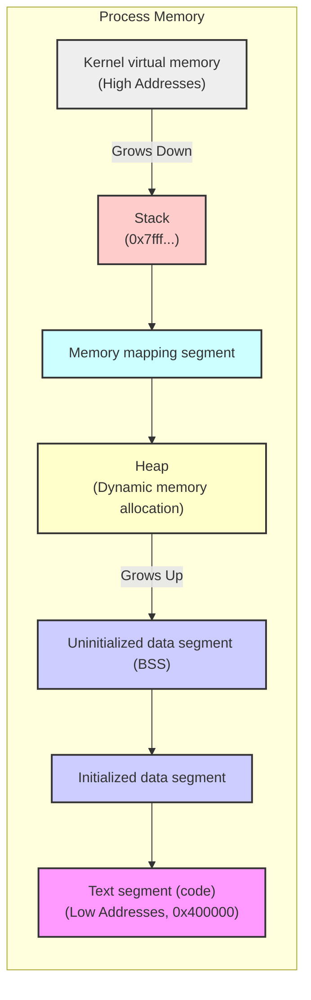

# 内存映射

> 跳过了 44-48 章，即 System V 相关的 API 介绍，它属于遗留 API，现在已经不推荐使用。

> 内存页的大小与 CPU 架构有关，程序内存分配及内存页大小相关信息详见第 6 与第 7 章笔记。

Linux 系统提供了 mmap() 系统调用来创建内存映射，内存映射可用于编程语言中的堆内存分配、进程间通信（IPC）以及其他很多方面。

mmap() 系统调用在调用进程的虚拟地址空间中创建一个新的内存映射，映射分为两种：

1. 文件映射：文件映射将文件的一部分直接映射到调用进程的虚拟内存中。
   - 完成文件映射之后，就可以通过直接读写相应的内存区域实现对文件的读写了，映射的分页内容会在需要的时候由内核自动加载。
2. 匿名映射：匿名映射不涉及文件系统，它直接在内存中分配空间，并将分页的内容都初始化为 0。
   - 匿名映射常用于动态内存分配，例如 C 语言中的 `malloc()` 函数，以及 C++ 中的 `new`
     运算符，在底层实现时就可能使用匿名映射。

### mmap() 的主要用途

1.  **读写文件**：将文件内容映射到内存，避免了传统 `read()`/`write()`
    系统调用的数据拷贝，提高了文件 I/O 效率。
2.  **动态内存分配**：`malloc()` 等函数在分配大块内存时，可能会使用 `mmap()` 创建匿名映射。
3.  **加载共享库**：动态链接器将共享库的代码和数据段映射到进程地址空间。

### 进程内存空间分布

以下是一个典型的 Linux 进程内存空间分布图：

