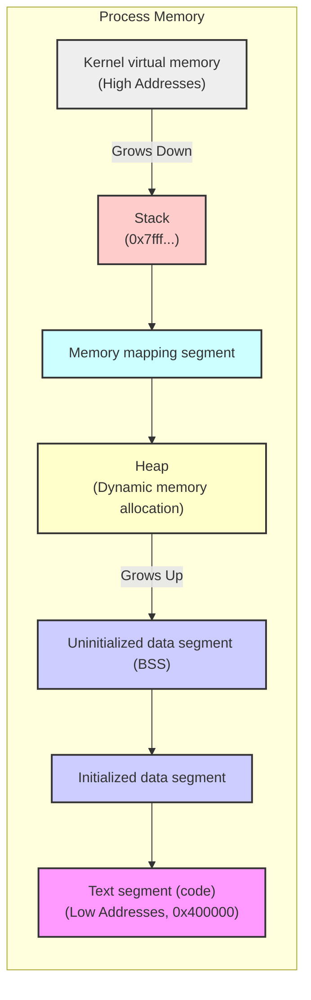

# 内存映射

> 跳过了 44-48 章，即 System V 相关的 API 介绍，它属于遗留 API，现在已经不推荐使用。

> 内存页的大小与 CPU 架构有关，程序内存分配及内存页大小相关信息详见第 6 与第 7 章笔记。

Linux 系统提供了 mmap() 系统调用来创建内存映射，内存映射可用于编程语言中的堆内存分配、进程间通信（IPC）以及其他很多方面。

mmap() 系统调用在调用进程的虚拟地址空间中创建一个新的内存映射，映射分为两种：

1. 文件映射：文件映射将文件的一部分直接映射到调用进程的虚拟内存中。
   - 完成文件映射之后，就可以通过直接读写相应的内存区域实现对文件的读写了，映射的分页内容会在需要的时候由内核自动加载。
2. 匿名映射：匿名映射不涉及文件系统，它直接在内存中分配空间，并将分页的内容都初始化为 0。
   - 匿名映射常用于动态内存分配，例如 C 语言中的 `malloc()` 函数，以及 C++ 中的 `new`
     运算符，在底层实现时就可能使用匿名映射。

依据内存映射的共享方式，它还可分为两种类型：

- 私有映射（MAP_PRIVATE）
  - 在映射内容上做的变更仅对自身进程可见。
  - 内核采用了 写时复制（Copy-on-Write）技术实现私有映射以提高性能，即只在发生写入时才真正为进程创建一个私有映射的副本。
- 共享映射（MAP_SHARED）
  - 共享映射的变更对所有相关进程都可见。
  - 对于文件映射来讲，共享映射上的修改会直接发生在底层的文件上。

## mmap() 的主要用途

各种内存映射参数组合的常见用途：

| 变更的可见性 | 文件映射                            | 匿名映射              |
| ------------ | ----------------------------------- | --------------------- |
| 私有         | 根据文件内容初始化内存              | 动态内存分配          |
| 共享         | 内存映射 I/O，进程间共享内存（IPC） | 进程间共享内存（IPC） |

1.  **读写文件**（内存映射 I/O）：将文件内容映射到内存，避免了传统 `read()`/`write()`
    系统调用的数据拷贝，在随机读写大文件时能明显提高文件 I/O 效率。
2.  **动态内存分配**：`malloc()` 等函数在分配大块内存时，可能会使用 `mmap()` 创建匿名映射。
3.  **加载共享库**（根据文件内容初始化内存）：动态链接器将共享库的代码和数据段映射到进程地址空间。
4.  进程间共享内存（IPC）：父子进程都能访问到同一内存映射，可通过它实现高效的 IPC. 缺点则是很容易出现难以排查的多线程 Bug...

## 内存映射使用的虚拟内存地址段

以下是一个典型的 Linux 进程内存空间分布图：



其中的 Memory Mapping Segment 就是内存映射使用的地址段。

## 创建内存映射

```c
#include<sys/mman.h>

// 创建内存映射
void *mmap(void *addr, size_t length, int prot, int flags, int fd, off_t offset);

// 解除内存映射
// addr - 映射区的起始地址
// length - 映射区的大小（字节数）
// 成功则返回 0，否则返回 -1.
int munmap(void *addr, size_t length);
```

**参数说明**：

- `addr`：映射区的起始地址，通常设为
  `NULL`，由系统自动选择合适的地址。如果指定了地址，系统会尝试在该地址创建映射，但并不保证成功。
- `length`：映射区的长度，以字节为单位。
- `prot`：映射区的保护方式，指定映射区域的访问权限。
- `flags`：映射区的标志，影响映射区的行为。
- `fd`：文件描述符，用于文件映射。如果是匿名映射，则设为 `-1`。
- `offset`：文件偏移量，从文件的哪个位置开始映射。必须是系统页大小的整数倍。

**返回值**（一个 `void *` 类型的指针）：

- 成功时返回映射区的起始地址。
- 失败时返回 `MAP_FAILED`，并设置 `errno`。

**prot 参数**：

`prot` 参数用于指定映射区域的保护方式，可以是以下标志的组合：

- `PROT_READ`：映射区可读。
- `PROT_WRITE`：映射区可写。
- `PROT_EXEC`：映射区可执行。
- `PROT_NONE`：映射区不可访问。

**flags 参数**：

`flags` 参数用于指定映射区的标志，可以是以下标志的组合：

- `MAP_SHARED`：共享映射。
- `MAP_PRIVATE`：私有映射。
- `MAP_ANONYMOUS`：匿名映射。如果指定了此标志，`fd` 必须为 `-1`。
- `MAP_FIXED`：如果指定了 `addr`，则强制系统使用该地址。如果该地址不可用，`mmap()`
  将失败。不建议使用此标志。
- `MAP_DENYWRITE`：设置此标志后，其他进程不能对被映射的文件执行写操作。
- `MAP_EXECUTABLE`：指定映射区域包含可执行代码。此标志在现代系统中通常被忽略，因为权限由 `prot`
  参数控制。

### 内存保护相关参数

内存保护通过 `mmap()` 的 `prot` 参数来设置，它定义了映射区域的访问权限。以下是可用的保护标志：

- `PROT_READ`：允许读取映射区域的内容。
- `PROT_WRITE`：允许修改映射区域的内容。
- `PROT_EXEC`：允许执行映射区域的代码。
- `PROT_NONE`：禁止访问映射区域。

这些标志可以通过 `|` 运算符组合使用，例如 `PROT_READ | PROT_WRITE` 表示映射区域可读写。

**注意事项**：

- `PROT_EXEC`
  标志允许执行映射区域的代码。但是，为了安全起见，现代操作系统通常会限制可写区域执行代码，或者限制可执行区域写入数据。这被称为 W^X（Write
  XOR Execute）策略。
- 尝试访问未授权的内存区域会导致 `SIGSEGV` 段错误信号，通常会导致程序崩溃。
  - 在 C 语言中，这个错误通常都是由指针越界引发的。

### 示例

创建一个可读写的匿名映射：

```c
#include <sys/mman.h>
#include <stdio.h>
#include <stdlib.h>
#include <unistd.h>

int main() {
    size_t length = 4096; // 页大小
    void *addr = mmap(NULL, length, PROT_READ | PROT_WRITE, MAP_PRIVATE | MAP_ANONYMOUS, -1, 0);
    if (addr == MAP_FAILED) {
        perror("mmap");
        exit(1);
    }

    // 使用映射区
    char *ptr = (char *)addr;
    sprintf(ptr, "Hello, mmap!");
    printf("%s\n", ptr);

    munmap(addr, length); // 释放映射区
    return 0;
}
```

创建一个文件映射的方式也完全类似，区别是传入的 fd 参数得是对应的文件描述符。在完成文件映射后，对应文件的 fd 文件描述符就可以关闭了，关掉它对文件映射不会有任何影响。

### 文件映射的边界情况

内存映射通常必须是系统分页大小的整数倍，而这会导致一些边界问题。

- 被映射文件 > 映射内存区域
  - 尝试访问文件尾部未被映射的部分，会导致 SIGSEGV 错误。
- 被映射文件 < 映射内存区域
  - 超出文件的部分内存会被初始化为 0，而且对它们的修改不会被同步到文件中。
  - 超出的部分内存显得有点无意义。

## MAP_NORESERVE 和过度利用交换空间

Linux 允许过度分配内存，即进程申请的内存总和可以超过系统实际可用的物理内存和交换空间之和。这是通过
`vm.overcommit_memory` 内核参数控制的。

`MAP_NORESERVE` 标志可以与 `mmap()` 一起使用，以进一步控制内存分配的行为。当使用 `MAP_NORESERVE`
标志时，系统不会为映射区域预留交换空间。这意味着即使系统允许过度分配内存，也不会为该映射区域保留相应的交换空间。

`vm.overcommit_memory` 参数有以下几个选项：

- `0`：内核会根据一定的算法来估算是否允许分配内存。
- `1`：内核允许分配所有的物理内存和交换空间，而不管实际是否可用。
- `2`：内核会拒绝分配超过 `swap + ram * overcommit_ratio` 大小的内存。`overcommit_ratio`
  的默认值是 50%。

`MAP_NORESERVE` 标志对内存分配的影响取决于 `vm.overcommit_memory`
的设置。下表总结了不同组合下的行为：

| `vm.overcommit_memory` 值 | mmap() 是否设置了 `MAP_NORESERVE` | 交换空间利用情况   |
| ------------------------- | --------------------------------- | ------------------ |
| 0                         | 否                                | 拒绝明显的过度利用 |
| 0                         | 是                                | 允许过度利用       |
| 1                         | 否                                | 同上               |
| 1                         | 是                                | 同上               |
| 2                         | 是                                | 严格的过度利用     |
| 2                         | 是                                | 同上               |

## Redis 与内存映射

Redis 是一个高性能的内存数据库，广泛用于缓存、消息队列等场景。它底层使用 jmalloc 做动态内存分配。

因为 Redis 大量使用了大块的内存，其底层肯定大量调用了 mmap() 系统调用，它提供了一些建议来优化内存映射的行为：

- `vm.overcommit_memory`：

  - 如前所述，此内核参数影响内存分配策略。Redis 建议将其设置为
    `1`，以允许过度分配内存，避免因内存不足而失败。
  - 在 Redis 配置文件中，可以通过 `sysctl vm.overcommit_memory=1` 或在 `/etc/sysctl.conf` 中设置。

- `transparent_hugepage`：
  - Redis 建议禁用透明大页（Transparent Huge Pages），因为它可能导致延迟问题。可以通过以下命令禁用：
    ```bash
    echo never > /sys/kernel/mm/transparent_hugepage/enabled
    ```
